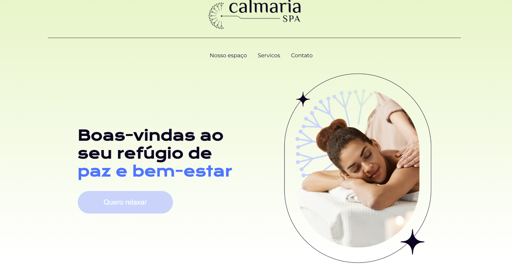

# Calmaria Spa

## ℹ️ Sobre

Projeto utilizado no curso para aprendizado das técnicas e melhores práticas.

## 📘Ementa

### SASS e CSS: estilizando um site

- Aprender como utilizar os recursos do pré-processador SASS em seus projetos
- Criar folhas de estilos de fácil leitura
- Criar códigos reutilizáveis com mixins, @extend e parent selector
- Modularizar as folhas de estilo com partial
- Utilizar as variáveis para colorir e ajustar o layout de uma landing page (site)
- Fazer operações matemáticas para construir layouts

## 🖥️ Tecnologias

  
  
  

## 🧑‍🏫 Instrutor(es)

| [ Diego Carlos](https://github.com/diegocgayoso) |
| :-----------------------------------------------------------------------------------------------------------------------------------------------------: |

## 💻 Screenshot

